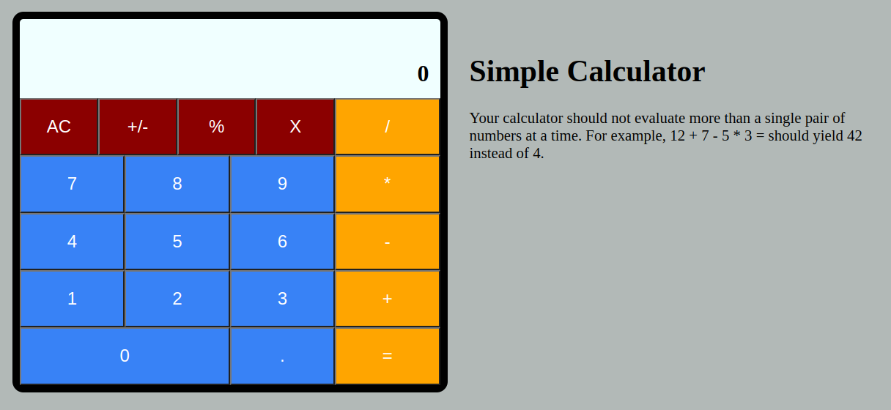

# odin_calculator

[Task Description](https://www.theodinproject.com/lessons/foundations-calculator)

[Live preview](https://maxim55069633.github.io/5.odin_calculator/)

This is a simple calculator, which can only calculate a pair of numbers at one time. 

Screenshot:

